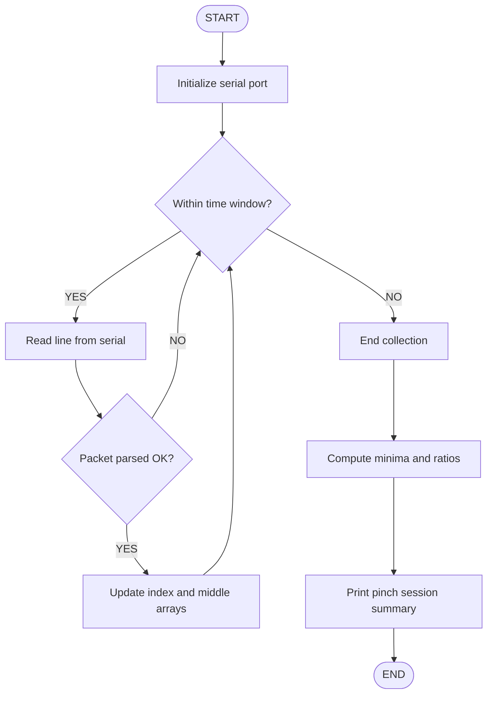

# 🪝 Pinch Strength Sensor Module  
**Index–Thumb (IT) & Middle–Thumb (MT)**

This module records **pinch strength** using distance/force values captured between:

- **Index–Thumb (IT)**
- **Middle–Thumb (MT)**

Data is streamed over serial from an Arduino (or similar device) in the format:

```text
index:123,middle:145

